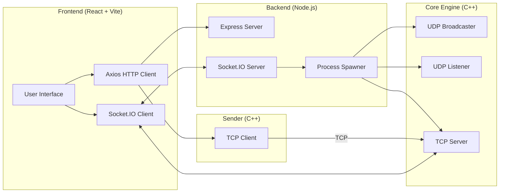
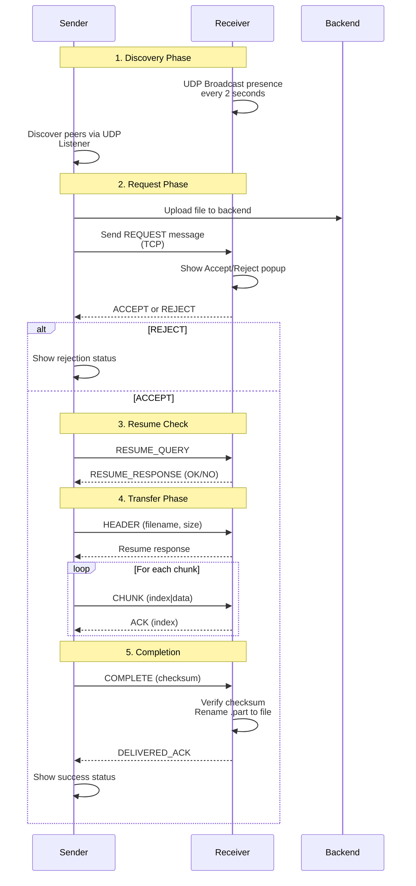

<!-- markdownlint-disable MD001 MD026 -->

<div align="center">

# ⚡ WinDrop

### Cross-Platform Peer-to-Peer File Transfer System

[](https://github.com/windrop/windrop)
[](LICENSE)
[](https://isocpp.org/)
[](https://react.dev/)

**Fast, secure, direct file transfers over your local network — no cloud required.**

</div>

---

## Overview

WinDrop is a cross-platform peer-to-peer file transfer system that enables fast, direct file sharing between devices on the same local network. Unlike cloud-based file transfer services, WinDrop transfers files directly from one device to another using TCP, ensuring:

- **Speed** — Transfer at full network speed without upload/download bottlenecks
- **Privacy** — Files never leave your local network
- **No Account Required** — No login, no subscription, no tracking
- **Automatic Discovery** — Peers are discovered automatically via UDP broadcast
- **Resume Support** — Interrupted transfers can be resumed from where they left off

---

## Features

| Feature | Description |
|---------|-------------|
| 🌍 **Cross-Platform** | Works on Windows, macOS, and Linux with a unified C++ networking engine |
| 🔍 **Automatic Discovery** | UDP broadcast-based peer discovery — peers appear automatically |
| 📤 **Direct TCP Transfer** | Files transfer directly between devices over TCP |
| ⏸️ **Resume Support** | Interrupted transfers can be resumed from the last acknowledged chunk |
| ✅ **Transfer Requests** | Receiver gets a popup to Accept or Reject incoming files |
| 📊 **Real-Time Progress** | Live progress updates during transfer |
| 🔐 **Checksum Verification** | SHA-based checksum ensures file integrity |
| 🎯 **Delivery Confirmation** | Sender receives confirmation when file is saved |
| 💻 **Modern React UI** | Clean, intuitive drag-and-drop interface |
| 🔌 **Socket.IO Signaling** | Real-time UI updates via WebSocket |

---

## Tech Stack

### Frontend

- **React 19** — UI framework
- **Vite** — Build tool and dev server
- **Socket.IO Client** — Real-time communication
- **Axios** — HTTP client

### Backend

- **Node.js** — JavaScript runtime
- **Express** — Web server framework
- **Socket.IO** — WebSocket server for UI sync
- **Multer** — File upload handling

### Core Engine

- **Modern C++ (C++17)** — High-performance networking
- **TCP Sockets** — Reliable file transfer protocol
- **UDP Broadcast** — Peer discovery mechanism
- **Platform Abstraction Layer** — Unified API for Windows/POSIX

---

## Architecture



### How It Works

1. **React UI** — Manages the user interface and file selection
2. **Node.js Backend** — Bridges the UI and C++ engine, handles file uploads
3. **C++ Core Engine** — Handles UDP peer discovery and TCP file reception
4. **C++ Sender** — Handles TCP file transmission with resume capability
5. **TCP** — Source of truth for the actual file transfer protocol

---

## File Transfer Workflow



### Workflow Steps

1. **Discover Peers** — UDP broadcast announces presence; listener discovers other peers
2. **Select File** — User drags/drops or clicks to select a file
3. **Upload to Backend** — File is uploaded to the Node.js backend first
4. **Send Transfer Request** — Sender sends REQUEST message via TCP
5. **Accept/Reject** — Receiver sees popup, chooses to accept or reject
6. **Resume Query** — Sender checks if partial transfer exists
7. **Header Exchange** — Transfer metadata (filename, size, chunks)
8. **Chunk Transfer** — File sent in 4KB chunks with ACK for each
9. **Checksum Verification** — Sender computes checksum; receiver verifies
10. **Delivery Confirmation** — Receiver sends DELIVERED_ACK to confirm

---

## Resume Transfer

WinDrop implements robust resume capability for interrupted transfers:

### How It Works

1. **Progress Metadata** — During transfer, metadata is saved to `<filename>.part.meta`:
   - `filename` — Original filename
   - `fileSize` — Total file size
   - `lastAckedChunk` — Last successfully acknowledged chunk
   - `chunkSize` — Size of each chunk
   - `totalChunks` — Total number of chunks

2. **Temporary Files** — Incoming data is saved to `<filename>.part` (not the final filename)

3. **Resume Query** — Before transfer:
   ```
   RESUME_QUERY:filename|filesize
   ```

4. **Resume Response** — Receiver responds:
   ```
   RESUME_RESPONSE:OK|lastChunk    # Can resume
   RESUME_RESPONSE:NO              # Cannot resume, start fresh
   ```

5. **Resuming** — Sender starts from `lastChunk + 1`, appends to existing `.part` file

6. **Periodic Saves** — Metadata is saved every 10 chunks to minimize data loss

7. **Atomic Rename** — On completion, `.part` is atomically renamed to final filename

---

## Networking Protocol

All messages are newline-delimited (`\n`) for easy parsing:

### Message Types

| Message | Direction | Format | Description |
|---------|-----------|--------|-------------|
| `REQUEST` | Sender → Receiver | `REQUEST:reqId\|filename\|size\|type\|name\|ip` | Transfer request with metadata |
| `REQUEST_ACCEPT` | Receiver → Sender | `REQUEST_ACCEPT:reqId` | User accepted the transfer |
| `REQUEST_REJECT` | Receiver → Sender | `REQUEST_REJECT:reqId\|reason` | User rejected the transfer |
| `RESUME_QUERY` | Sender → Receiver | `RESUME_QUERY:filename\|size` | Check for existing transfer |
| `RESUME_RESPONSE` | Receiver → Sender | `RESUME_RESPONSE:OK\|chunk` or `RESUME_RESPONSE:NO` | Resume capability response |
| `HEADER` | Sender → Receiver | `HEADER:filename\|size\|chunkSize\|totalChunks` | Transfer metadata |
| `CHUNK` | Sender → Receiver | `CHUNK:index\|size\n<data>` | File chunk data |
| `ACK` | Receiver → Sender | `ACK:index` | Acknowledgment for chunk |
| `COMPLETE` | Sender → Receiver | `COMPLETE:checksum` | Transfer complete with checksum |
| `DELIVERED_ACK` | Receiver → Sender | `DELIVERED_ACK:reqId` | File saved successfully |

### Protocol Flow

```
REQUEST → (ACCEPT | REJECT)
    ↓
RESUME_QUERY → RESUME_RESPONSE
    ↓
HEADER → RESUME_RESPONSE
    ↓
(CHUNK → ACK)* 
    ↓
COMPLETE → DELIVERED_ACK
```

---

## Project Structure

```
WinDrop/
├── README.md                    # This file
├── LICENSE                       # MIT License
├── start.sh                      # Build and run script
│
├── backend/                      # Backend server
│   ├── index.js                  # Express + Socket.IO server
│   ├── package.json              # Node.js dependencies
│   ├── core.cpp                  # UDP broadcaster/listener + TCP receiver
│   ├── sender.cpp                # TCP file sender with resume
│   ├── platform.h               # Platform abstraction header
│   ├── platform.cpp             # Platform abstraction implementation
│   ├── transfer_meta.h          # Protocol definitions & metadata
│   └── uploads/                  # Temporary file uploads (created at runtime)
│
└── frontend/                     # React frontend
    ├── package.json              # Frontend dependencies
    ├── vite.config.js            # Vite configuration
    ├── index.html               # HTML entry point
    └── src/
        ├── main.jsx             # React entry point
        ├── App.jsx              # Main application component
        └── App.css              # Component styles
```

### Key Files

| File | Purpose |
|------|---------|
| `backend/index.js` | Express server, Socket.IO signaling, file upload handling |
| `backend/core.cpp` | UDP discovery, TCP receiver, chunk handling, resume logic |
| `backend/sender.cpp` | TCP sender with request mode, chunk transmission, ACK handling |
| `backend/platform.h` | Cross-platform abstraction layer definitions |
| `backend/platform.cpp` | WinSock2/POSIX socket implementation |
| `backend/transfer_meta.h` | Protocol message parsing/building, metadata persistence |
| `frontend/src/App.jsx` | React UI with drag-drop, peer list, transfer progress |

---

## Screenshots

### Home / Peer Discovery

*(Add screenshot showing the main UI with discovered peers)*

### Incoming Transfer Request

*(Add screenshot showing the Accept/Reject popup)*

### File Transfer Progress

*(Add screenshot showing progress bar during transfer)*

### Transfer Complete

*(Add screenshot showing successful delivery confirmation)*

---

## Installation

### Prerequisites

- **Node.js** (v18+) — [Download](https://nodejs.org/)
- **C++ Compiler**:
  - macOS/Linux: `g++` (comes with Xcode/macOS Command Line Tools)
  - Windows: MinGW-w64 or Visual Studio

### Quick Start

```bash
# Clone or download the project
cd WinDrop

# Run the startup script
./start.sh
```

The script will:
1. Install backend dependencies (`npm install`)
2. Compile the C++ networking engine
3. Start the backend server
4. Install frontend dependencies
5. Launch the frontend dev server

Open [http://localhost:5173](http://localhost:5173) in your browser.

---

### Manual Installation

#### 1. Backend Setup

```bash
cd backend

# Install Node.js dependencies
npm install

# Compile C++ components (macOS/Linux)
g++ -std=c++17 -pthread platform.cpp core.cpp -o core
g++ -std=c++17 -pthread platform.cpp sender.cpp -o sender

# Compile C++ components (Windows with MinGW)
g++ -std=c++17 -pthread platform.cpp core.cpp -o core.exe -lws2_32 -liphlpapi
g++ -std=c++17 -pthread platform.cpp sender.cpp -o sender.exe -lws2_32 -liphlpapi
```

#### 2. Run Backend

```bash
# Start the C++ core engine
./core &    # macOS/Linux
# or
core.exe &  # Windows

# Start the Node.js server
node index.js
```

#### 3. Frontend Setup

```bash
cd frontend

# Install dependencies
npm install

# Start development server
npm run dev
```

#### 4. Open UI

Navigate to [http://localhost:5173](http://localhost:5173)

---

### Network Configuration

Ensure the following ports are accessible:

| Port | Protocol | Purpose |
|------|----------|---------|
| 8888 | UDP | Peer discovery broadcast |
| 8080 | TCP | File transfer |
| 5001 | HTTP | Backend API |
| 5173 | HTTP | Frontend dev server |

---

## Future Improvements

- **📁 Folder Transfer** — Transfer entire directories
- **🔒 End-to-End Encryption** — Encrypt file content before transfer
- **📊 Transfer Speed Graph** — Real-time speed visualization
- **📱 Mobile Support** — iOS/Android companion apps
- **🔗 QR Code Pairing** — Quick peer pairing via QR code
- **📨 Multiple Simultaneous Transfers** — Queue and parallel transfers
- **📋 Transfer History** — Log of past transfers
- **⚙️ Settings UI** — Configure ports, save locations, etc.

---

## Learning Outcomes

Building WinDrop involved learning and implementing:

- **TCP Socket Programming** — Reliable connection-oriented communication
- **UDP Discovery** — Broadcasting and listening for peer announcement
- **Cross-Platform Networking** — WinSock2 vs POSIX socket differences
- **React + Node Integration** — Connecting frontend to backend services
- **Process Spawning** — Running C++ executables from Node.js
- **Custom Application-Layer Protocols** — Designing message formats
- **Resume Algorithms** — State persistence and transfer continuation
- **File Integrity Verification** — Checksum computation and validation
- **Threading** — Concurrent UDP listener, broadcaster, and TCP receiver
- **Platform Abstraction** — Unified APIs across Windows/macOS/Linux

---

## License

MIT License — See [LICENSE](LICENSE) for details.

---

<div align="center">

**Made with ❤️ for fast, local file transfers**

</div>